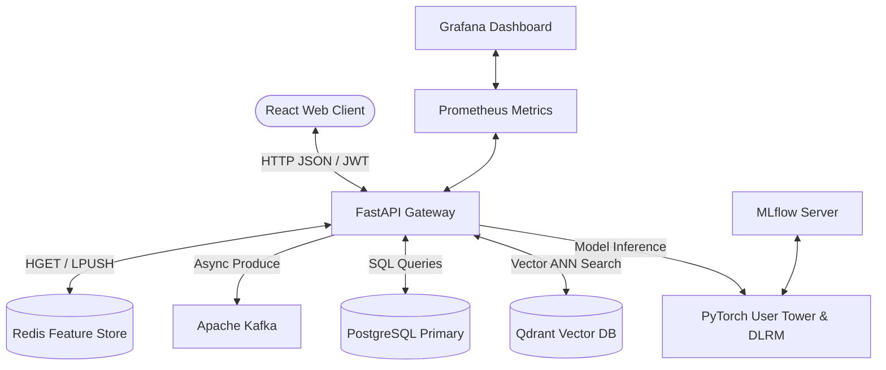

# Project Overview — Suggestify V2
### A High-Performance, Multi-Stage Hybrid Recommendation Engine

This document provides a slide-by-slide overview of the **Suggestify V2** project architecture, machine learning pipeline, data model, and optimizations to help you build a professional presentation (PPT).

---

## Slide 1: Title & Project Mission
* **Title:** Suggestify V2 — Next Generation Smart Recommendations
* **Subtitle:** Dual-Stage Retrieval & Ranking Engine with Multi-Source Personalization
* **Goal:** Deliver highly personalized recommendations for **406,000+ items** (movies, TV shows, anime, and books) under **30ms latency** using hybrid deep learning models (Two-Tower & DLRM) and real-time user state tracking.

---

## Slide 2: The Core Problem & Solution
* **The Problem:**
  * **Scale:** Querying 500,000+ items and predicting interaction probabilities in real-time is CPU/memory heavy.
  * **Cold Start:** New users/items lack interaction history.
  * **Filter Bubbles:** Personalization can cause feedback loops where users see only a single genre.
* **The Solution (Dual-Stage Pipeline):**
  * **Stage 1 (Retrieval):** Sift 500,000+ items down to **top 500 candidates** in <10ms using vector similarity (Two-Tower).
  * **Stage 2 (Reranking):** Rerank those 500 candidates using a deep neural network (DLRM) blended with heuristics (popularity, recency, ratings).
  * **Exploration:** Apply **Maximal Marginal Relevance (MMR)** and **Contextual Bandits** to inject freshness and diversity.

---

## Slide 3: Technology Stack
Suggestify V2 is built on a modern, distributed, and containerized microservice stack:
* **Frontend:** React, TypeScript, Tailwind CSS, Vite (Single Page App).
* **Backend:** FastAPI (Python), Uvicorn, Pydantic (Asynchronous REST API).
* **Vector database:** Qdrant (Approximate Nearest Neighbors / ANN search).
* **Primary Database:** PostgreSQL (Metadata, relational logs, schemas).
* **Caching & Features:** Redis (Session caching, real-time user profile features).
* **Event Broker:** Apache Kafka (Real-time user click & signal ingestion).
* **MLOps & Monitoring:** Prometheus (Metrics), Grafana (Dashboards), MLflow (Experiment tracking).

---

## Slide 4: System Architecture Diagram

---

## Slide 5: Stage 1 — Two-Tower Retrieval Model
* **Concept:** User traits and Item properties are mapped into a shared **128-dimensional embedding space** using deep neural networks (towers).
* **User Tower Inputs:**
  * User ID (hashed index)
  * Preferred content type (movie, TV, anime, book)
  * Preferred genres (50-dimensional binary vector)
* **Item Tower Inputs:**
  * Item ID
  * Content Type
  * Genres vector
* **Retrieval Mechanism:**
  * User embedding is computed on the fly on request.
  * Qdrant queries the index using **Cosine Distance** to find top 500 candidate vectors in **<5ms**.

---

## Slide 6: Stage 2 — DLRM & Heuristic Reranking
* **Deep Learning Recommendation Model (DLRM):**
  * Takes sparse categorical inputs (User ID, Item ID, Content Type, Genres) and dense numerical inputs (Cosine similarity, rating, genre boosts, recency, popularity).
  * Learns **cross-feature interactions** using dot products to predict interaction probability.
* **Blended Heuristic Ranker:**
  * Blends model scores with metadata rules to ensure quality:
  * **Formula:** `Score = 0.4 * cosine_similarity + 0.2 * normalized_rating + 0.2 * genre_match_score + 0.1 * recency_score + 0.1 * popularity_score`
  * Blended Score = `α * DLRM_Score + (1 - α) * Heuristic_Score`

---

## Slide 7: Exploration, Diversity & Bandit Framework
* **MMR (Maximal Marginal Relevance):**
  * Selects items that have high relevance but **low similarity to already selected items** in the list.
  * Filters out repetitive suggestions (e.g. stops the feed from showing 10 superhero movies in a row).
* **Epsilon-Greedy Bandits:**
  * Dedicates a portion (e.g. 15%) of the recommendation slots to **random exploration** from the candidate pool.
  * Helps collect fresh feedback data and discover new user interests.

---

## Slide 8: A/B Testing & Relational Data Model
* ** relational engine:**
  * PostgreSQL manages core relational metadata, user logins, interaction logs, and A/B configurations.
* **A/B Testing Module:**
  * Users are assigned to variants on conflict:
    * **Variant A (Control):** Receives popularity-sorted recommendations.
    * **Variant B (Treatment):** Receives full Two-Tower + DLRM personalized recommendations.
  * Interaction events (impressions, clicks, watch time) are tracked by variant to calculate CTR (Click-Through Rate).

---

## Slide 9: Performance Optimizations (The Latency Transformation)
To scale to **406,000+ items** and keep loading speeds instantaneous, the following optimizations were implemented:

* **Redis Layout Cache:** Assembled row layouts are cached with a **60s TTL**. Warm loads now respond in **13 milliseconds**.
* **Qdrant Payload Indexing:** Created keyword indices for `item_id` and `content_type`. Eliminated Qdrant full-scans, cutting cold query times by **3.5x**.
* **Postgres Database Indexing:** Created B-Tree index on the `imdb_id` column of the `items` table. Eliminated sequential full-table scans during Pass 2 lookup.
* **Non-Blocking Background Tasks:** Outgoing calls (like fetching trailers/posters from TMDB external API) are queued via FastAPI's `BackgroundTasks`, returning HTTP responses to the user instantly.

---

## Slide 10: Key Metrics & Summary
* **Active Collection Size:** 549,553 items
* **Vector Dimensionality:** 128 Dimensions
* **Average Cached API Response Time:** **13.8 ms**
* **Average Cold Search Latency:** **~990 ms**
* **Inference Pipeline:** PyTorch CPU execution
* **System Health:** 100% healthy (verified via Prometheus telemetry)
